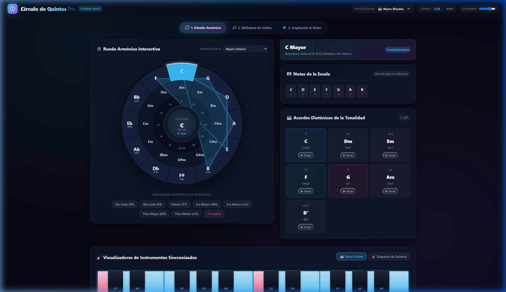
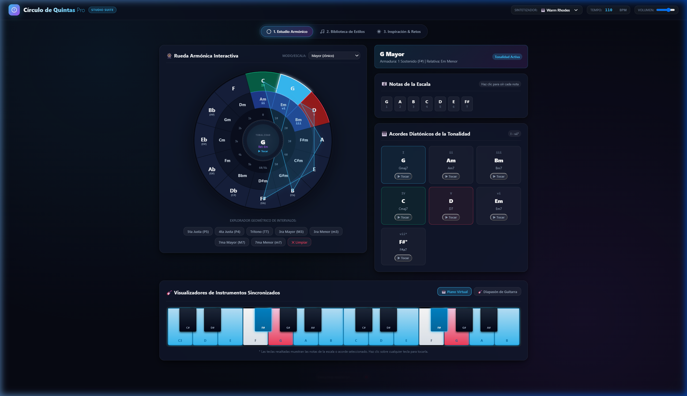
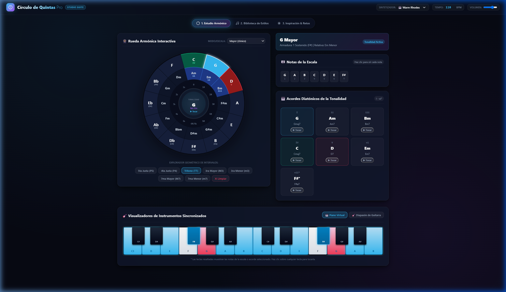
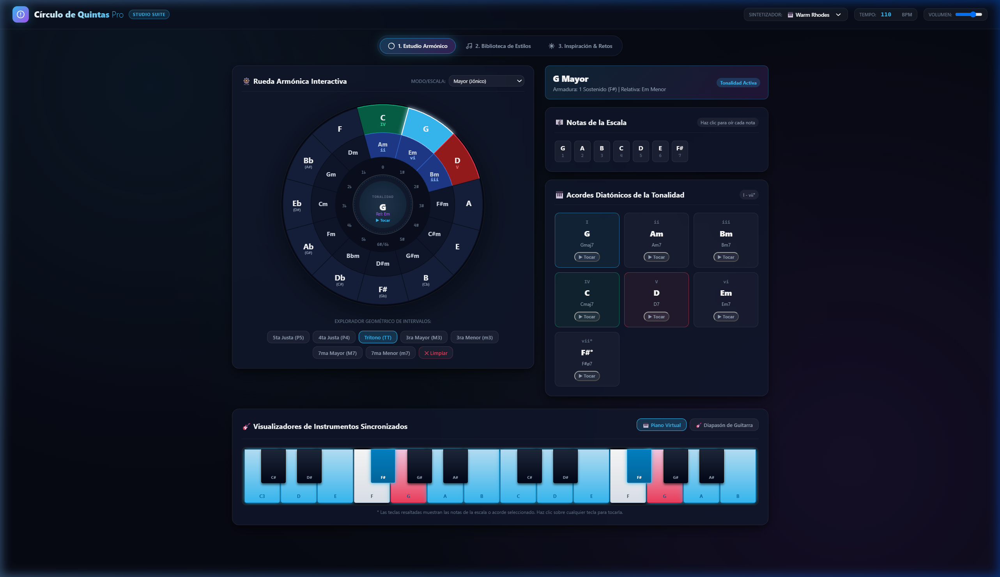
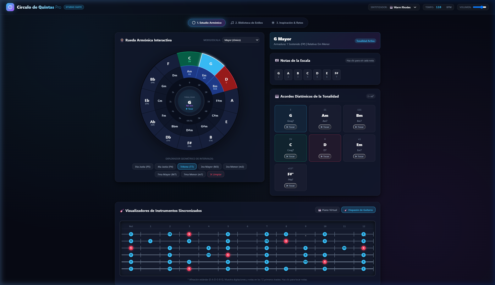
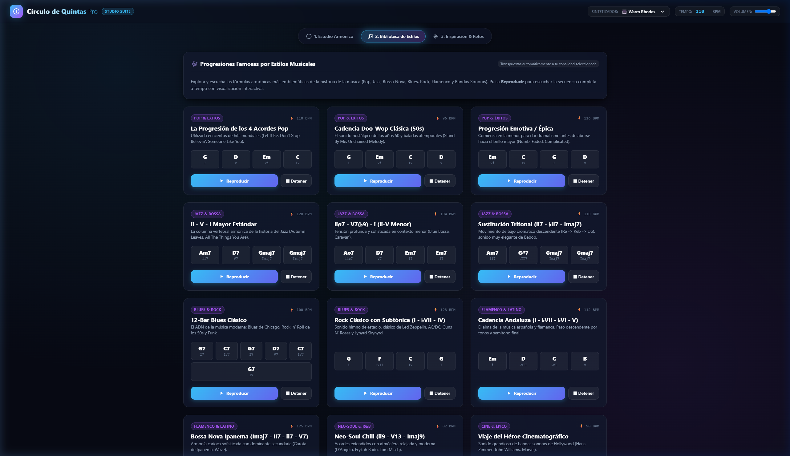
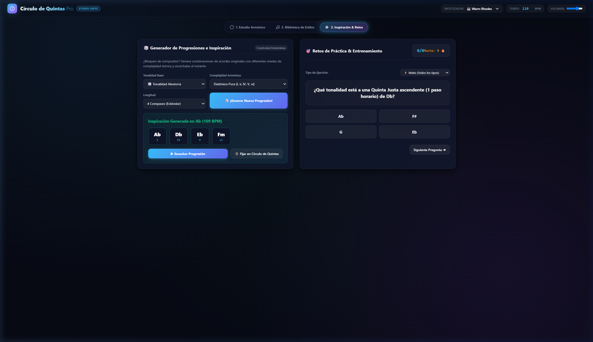

# 🎡 Círculo de Quintas Pro | Suite Interactiva para Músicos

[](LICENSE)
[](#)
[](#)
[](#)
[](#)

> Una suite web interactiva, moderna y 100% autónoma diseñada para músicos, compositores, docentes y estudiantes. Explora la armonía tonal, practica intervalos, visualiza acordes en piano y guitarra, y desbloquea tu creatividad con progresiones por estilos y generación aleatoria de ideas.

---

## 📸 Vistas de la Aplicación

### 1. Estudio Armónico y Rueda de Quintas Interactiva
Visualización en tiempo real de grados armónicos (**I, ii, iii, IV, V, vi, vii°**), tonalidades relativas, notas de la escala y acordes diatónicos clicables con audio polifónico.



---

### 2. Exploración Dinámica por Tonalidades
Al seleccionar cualquier tonalidad mayor o menor en la rueda, se recalculan automáticamente las armaduras de clave (# y ♭), las notas de la escala y los acordes vecinos.



---

### 3. Geometría de Intervalos y Modos Diatónicos
Rayos visuales que conectan notas para analizar intervalos clave como el **Tritono (TT)**, **Quintas Justas (P5)**, **Cuartas (P4)** y polígonos de modos (Dórico, Frigio, Lidio, Mixolidio, etc.).



---

### 4. Visualizadores de Instrumentos Sincronizados

#### 🎹 Teclado de Piano Virtual (2 Octavas)
Muestra en tiempo real las teclas activas de cada acorde o escala. Permite tocar cualquier nota directamente con el ratón.



#### 🎸 Diapasón de Guitarra (Fretboard de 12 Trastes)
Mástil de 6 cuerdas con afinación estándar (`E-A-D-G-B-E`), marcadores en trastes 3, 5, 7, 9 y 12, con notas clicables y colores de tónica destacados.



---

### 5. Biblioteca de Progresiones por Estilos Musicales
Catálogo de fórmulas armónicas famosas (**Pop, Jazz Standard, Blues de 12 compases, Cadencia Andaluza, Bossa Nova, Neo-Soul y Música Épica**), transpuestas en tiempo real a cualquier tonalidad con secuenciador a tempo.



---

### 6. Generador de Inspiración y Arena de Retos (Quiz)
Generador de acordes con complejidad armónica ajustable (diatónica, extendida o intercambio modal) junto a un módulo de entrenamiento auditivo y teórico con puntuación y rachas.



---

## 🚀 Características Principales

- 🎡 **Círculo de Quintas SVG**: Tonalidades mayores, relativas menores, armaduras de clave (#/♭) y grados armónicos automáticos.
- 🎹 **Sintetizador Web Audio API**: 4 timbres de sonido (*Warm Rhodes, Piano Acústico, Ambient Pad, Pluck*) con control de BPM y volumen maestro.
- 🎸 **Instrumentos Duales**: Piano y Diapasón de Guitarra interactivos y sincronizados.
- 🎶 **Biblioteca de Estilos**: Pop, Jazz, Blues, Flamenco, Neo-Soul y Cine con reproducción rítmica.
- 🎲 **Inspiración y Retos**: Generador de progresiones aleatorias y quiz de entrenamiento musical.
- 🛡️ **100% Offline y Portable**: Todo el código CSS, HTML y JS está integrado en [index.html](index.html) sin dependencias externas ni peticiones de red.

---

## 📂 Estructura del Repositorio

```text
CirculoDequintas/
│
├── index.html                  # Aplicación completa 100% portable y offline
├── Circulo_de_Quintas_Demo.mp4 # Video demo en 1080p con locución en castellano
├── SGS.mp3                     # Pista de audio de fondo
├── README.md                   # Documentación principal con capturas
│
├── docs/
│   └── screenshots/            # Capturas de pantalla en alta resolución
│       ├── 01_estudio_armonico.png
│       ├── 02_rueda_grados.png
│       ├── 03_intervalos_modos.png
│       ├── 04_piano_virtual.png
│       ├── 05_guitarra_fretboard.png
│       ├── 06_biblioteca_estilos.png
│       └── 07_inspiracion_quiz.png
│
├── css/
│   └── styles.css              # Hoja de estilos Cyber-Acoustic Dark Mode
│
└── js/
    ├── musicTheory.js          # Motor de teoría musical, escalas, acordes y presets
    ├── audio.js                # Síntesis polifónica Web Audio API y secuenciador
    ├── circle.js               # Renderizador SVG interactivo del Círculo de Quintas
    ├── instruments.js          # Visualizadores de Piano Virtual y Mástil de Guitarra
    └── app.js                  # Orquestador y controlador principal de eventos
```

---

## 💻 Instalación y Uso Rápido

No se requiere ningún paso de compilación ni instalación de paquetes (`npm`, `yarn`, etc.).

1. **Clona el repositorio**:
   ```bash
   git clone https://github.com/cdcespon/circulodequintas.git
   ```
2. **Abre la aplicación**:
   - Haz doble clic en `index.html` en tu explorador de archivos para abrirlo en tu navegador favorito (Chrome, Firefox, Edge, Safari, Brave).
   - O sirve los archivos localmente:
     ```bash
     python -m http.server 8080
     ```
     y navega a `http://localhost:8080`.

---

## 🛠️ Tecnologías Utilizadas

- **HTML5 Semántico** y **SVG Dinámico** para renderizado vectorial de alta nitidez.
- **CSS3 Moderno**: Variables CSS personalizadas, Grid, Flexbox, efectos *Glassmorphism* y animaciones de brillo neón.
- **JavaScript Moderno (ES6+)**: Lógica modular orientada a eventos.
- **Web Audio API**: Generación de ondas (seno, sierra, triángulo), envolventes ADSR, filtros pasa-bajos, delays de reverberación y compresores dinámicos.

---

## 🤝 Contribuciones y Comunidad

Este es un proyecto **Open Source** abierto y gratuito para la comunidad. Si deseas agregar nuevos estilos musicales, escalas exóticas, afinaciones alternativas de guitarra u otras mejoras:

1. Haz un **Fork** del proyecto.
2. Crea una rama para tu feature: `git checkout -b feature/nueva-funcionalidad`.
3. Haz commit de tus cambios: `git commit -m 'feat: agrega nueva funcionalidad'`.
4. Haz push a tu rama: `git push origin feature/nueva-funcionalidad`.
5. Abre un **Pull Request**.

---

## 📄 Licencia

Distribuido bajo la Licencia MIT. Consulta el archivo `LICENSE` para más información.
